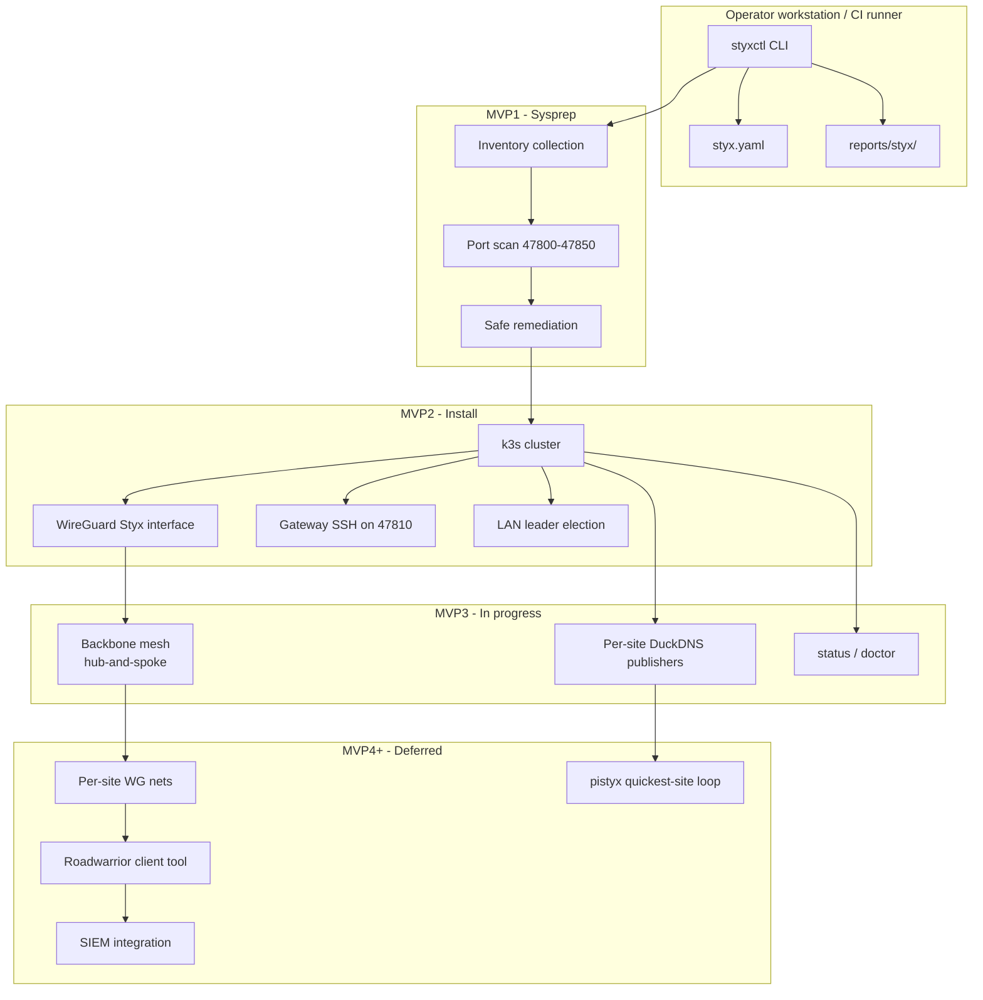

# styxctl

**The control CLI for [Styx](https://github.com/BradyWill42/styx)** - a k3s-native, dual-stack WireGuard mesh and access gateway platform.

`styxctl` prepares Linux gateway nodes, installs the k3s + WireGuard foundation, publishes per-site DuckDNS records, and brings up the current Styx backbone mesh. The CLI is **command-discovery-first**: composable subcommands, no workflow flags, and shell tab completion.

| | |
|---|---|
| **Version** | `0.3.0` |
| **Python** | 3.10+ |
| **License** | MIT |
| **Status** | MVP1 + MVP2 shipped; MVP3 in progress on `main` |

---

## Table of contents

- [What is Styx?](#what-is-styx)
- [Architecture](#architecture)
- [Repository](#repository)
- [Quick start](#quick-start)
- [Milestone roadmap](#milestone-roadmap)
- [MVP1: Assess and remediate](#mvp1-assess-and-remediate)
- [MVP2: Install prerequisites](#mvp2-install-prerequisites)
- [MVP3: Mesh, DNS, status, and doctor](#mvp3-mesh-dns-status-and-doctor)
- [Configuration (`styx.yaml`)](#configuration-styxyaml)
- [Reserved port plan](#reserved-port-plan)
- [Safety doctrine](#safety-doctrine)
- [Command reference](#command-reference)
- [Reports and artifacts](#reports-and-artifacts)
- [Troubleshooting](#troubleshooting)
- [Development](#development)
- [Continuous integration](#continuous-integration)
- [Known issues and deferred work](#known-issues-and-deferred-work)
- [License](#license)

---

## What is Styx?

Styx is a homelab and small-site platform that combines:

- **k3s** for lightweight Kubernetes orchestration across gateway nodes
- **Dual-stack WireGuard** (`Styx` interface on UDP `47800`) for the current backbone mesh, separate from any existing `wg0` tunnel
- **Reserved service ports** (`47800-47850`) for gateway APIs, agents, diagnostics, SSH, k3s API, metrics, and future services
- **Declarative cluster config** in `styx.yaml`: nodes, roles, hostnames, site topology, DNS publishing, and future client/SIEM work
- **Site-aware routing** for multiple Pis on one LAN behind one router, using LAN leader election and ProxyJump when needed

`styxctl` is the operator-facing tool that drives each phase. It collects inventory, remediates only what is provably safe, installs k3s with the built-in Styx IP plan, brings up the hub-and-spoke WireGuard backbone, and writes human-readable plus machine-readable reports along the way.

---

## Architecture



**Node roles** (defined in `styx.yaml`):

| Role | Purpose |
|------|---------|
| `init-server` | The single k3s bootstrap node; installed with `--cluster-init`; current WireGuard backbone hub |
| `server` | Additional k3s server/control-plane node |
| `agent` | k3s worker node |

Exactly one node may be `init-server`. "Site leader" is a separate overlay role: the leader is the port-forward face for a LAN/site, the DuckDNS publisher target for that site, and the future site uplink.

Each node can use:

- `public_ipv4` / `public_ipv6` for WAN bootstrap and DNS publishing
- explicit `hostname` values, usually unique DuckDNS names such as `pipegasus.duckdns.org`, for cross-site discovery
- `lan_ip` for co-located nodes behind one public IP
- mesh `ipv4` / `ipv6` addresses assigned from the built-in Styx plan for k3s `--node-ip`
- gateway ports `47810` (SSH) and `47811` (k3s API)

**Port 22 stays admin/runner SSH.** `install apply local` adds Styx gateway SSH on `gateway.ssh_port` (`47810`) alongside port 22; it does not replace the normal admin path.

---

## Repository

All development happens on [`main`](https://github.com/BradyWill42/styx/tree/main). It contains:

- MVP1 sysprep and safe remediation
- MVP2 local install, cluster install, LAN leader election, and uninstall
- bootstrap discovery by public IP detection, explicit DuckDNS hostname resolution, and LAN scanning
- MVP3 `deploy dns`, top-level `status` / `doctor`, and `mesh plan` / `mesh up`
- CI scripts that generate `styx.yaml` from live runner labels for the primary integration gate

Current bootstrap rule of thumb:

- Remote peer discovery uses explicit node `hostname` values. `styxctl` only resolves DNS; it does not need a DuckDNS token for discovery.
- Co-located peer discovery uses the shared public IP plus a LAN scan on gateway SSH port `47810`.
- Only the site leader/entrypoint needs inbound WAN port forwards for a shared-WAN site.
- The DuckDNS token is only used later by `styxctl deploy dns apply`, where it becomes a Kubernetes Secret.

---

## Quick start

### 1. Install `styxctl`

```bash
git clone https://github.com/BradyWill42/styx.git
cd styx

python3 -m venv .venv
source .venv/bin/activate
python -m pip install --upgrade pip
python -m pip install -e .
```

Verify:

```bash
styxctl version
styxctl --help
```

### 2. Prepare a gateway node (MVP1)

```bash
styxctl sysprep check local
styxctl sysprep safe plan local      # preview only
styxctl sysprep safe apply local     # apply without prompt
styxctl sysprep check local          # re-check until READY
```

### 3. Configure the cluster

```bash
cp styx.yaml.example styx.yaml
# for a manual deploy, add `role:` to each node (exactly one init-server); CI injects it from labels
styxctl config show
styxctl config validate
```

For a real cross-site deployment, set explicit, unique node `hostname:` values. Do **not** derive `{node}.duckdns.org` from bare names unless you own those subdomains.

### 4. Install the foundation (MVP2)

Run local install on every gateway:

```bash
styxctl install plan local
styxctl install apply local
styxctl install status local
```

Then from the init-server/operator path:

```bash
styxctl install plan cluster
styxctl install apply cluster
styxctl install doctor cluster
```

### 5. Bring up the current MVP3 pieces

On the init-server after the cluster is healthy:

```bash
styxctl mesh plan
styxctl mesh up

styxctl deploy dns plan
export DUCKDNS_TOKEN=...
styxctl deploy dns apply

styxctl status
styxctl doctor
```

### Requirements

| Requirement | MVP1 | MVP2/MVP3 |
|-------------|------|-----------|
| Linux gateway host | Yes | Yes |
| Python 3.10+ (for CLI) | Yes | Yes |
| `sudo` (non-interactive for mutating commands) | Recommended | Required |
| `ss` / `iproute2` | Recommended | Installed or verified by MVP2 |
| WireGuard tools | No | Required for install/mesh |
| `curl` + CA certificates | No | Required for install, IP detection, DuckDNS updater |
| Passwordless/key-based SSH to configured nodes | No | Required for cluster install/status/mesh/uninstall |
| `kubectl` on init-server | No | Required for `deploy dns`, `status`, and `doctor` |
| `styx.yaml` | Optional | Required |

---

## Milestone roadmap

| Milestone | Status | Scope |
|-----------|--------|-------|
| **MVP1** | Shipped | Read-only inventory, reserved port scan, safe remediation |
| **MVP2** | Shipped | k3s install, `Styx` WireGuard interface, gateway SSH, multi-node cluster join, uninstall |
| **MVP3** | In progress | `mesh plan/up`, `deploy dns plan/apply`, top-level `status` / `doctor`; remaining `gateway`, `sysprep reset` / `nuke` deferred |
| **MVP4** | Planned | Remote sysprep (`check all` / `check node`), roadwarrior `client`, SIEM |

Placeholder commands still print a clear "not implemented" message and make no changes.

---

## MVP1: Assess and remediate

MVP1 answers one question: **is this node safe to install Styx on?**

### Typical workflow

```bash
styxctl sysprep check local
styxctl sysprep safe plan local
styxctl sysprep safe apply local
styxctl sysprep check local
```

1. **Check** - read-only inventory and port scan
2. **Plan** - preview safe cleanup actions
3. **Apply** - execute safe cleanup, or use `sysprep safe local` for interactive confirm
4. **Re-check** - repeat until `READY` or `READY_WITH_WARNINGS`

### What `sysprep check local` collects

- Host identity, OS, kernel, architecture, boot time
- Network interfaces, default route, DNS resolvers, LAN IPs
- WireGuard interfaces, including `wg0` preservation status
- Processes and systemd units listening on ports `47800-47850`
- k3s / flannel / CNI artifacts and leftover services
- Sudo availability, time sync, disk and memory snapshot
- Detected binaries (`k3s`, `kubectl`, `wg`, `ss`, etc.)

### Readiness status

| Status | Meaning | Exit code |
|--------|---------|-----------|
| `READY` | Clear to proceed to MVP2 | `0` |
| `READY_WITH_WARNINGS` | Usable; review warnings first | `0` |
| `BLOCKED` | Critical ports `47800-47808` occupied | `1` |

When blocked, try `styxctl sysprep safe plan local` to preview cleanup, or `styxctl ports check local` to inspect conflicts.

### Safe remediation scope

**Will act on** (only when marked `safe_to_stop`):

- Styx / k3s / flannel / CNI processes in the reserved port range
- Known leftover services: `k3s.service`, `k3s-agent.service`
- Temporary Styx files under `/tmp/styx*` and `/var/tmp/styx*`

**Will never touch**:

- `wg0` or its configuration
- LAN networking, SSH, BIND, Caddy, MooseFS, home directories
- Unsafe port conflicts (non-Styx/k3s processes)
- k3s data directories (reserved for future reset/nuke work)

### Port commands

```bash
styxctl ports check local          # conflicts in 47800-47850
styxctl ports list local           # full port plan
styxctl ports clear plan local     # preview safe port cleanup
styxctl ports clear apply local    # apply safe port cleanup
styxctl ports clear local          # interactive confirm
```

---

## MVP2: Install prerequisites

After MVP1 reports `READY` or `READY_WITH_WARNINGS`, MVP2 installs the local foundation on each node and optionally joins a multi-node k3s cluster.

### Typical workflow

```bash
cp styx.yaml.example styx.yaml   # add `role:` per node for a manual deploy (CI injects from labels)
styxctl config validate

# Per-node local install (run on every gateway)
styxctl install plan local
styxctl install apply local

# Cluster join from the init-server/operator path
styxctl install plan cluster
styxctl install apply cluster

# Verify
styxctl install status local
styxctl install status cluster
styxctl install doctor local
styxctl install doctor cluster
```

Each node uses:

- `hostname` - explicit DuckDNS/FQDN name for remote discovery and TLS SANs
- `public_ipv4` - router WAN IP with 1:1 forwards for the site entrypoint or remote node
- `public_ipv6` - optional public IPv6, also published by DuckDNS when available
- `lan_ip` - LAN address for co-located nodes sharing one `public_ipv4`
- `site_entrypoint` - optional static marker for the node that owns router forwards
- `ipv4` / `ipv6` - mesh addresses passed to k3s as `--node-ip`

Bootstrap order: config enrichment -> local install -> LAN leader election (if enabled) -> cluster join -> status/doctor checks -> mesh/DNS deploy.

### LAN leader election

When multiple Styx gateways share a LAN, they automatically elect a leader (always on — there is no toggle). The election timing is tunable in `styx.yaml`:

```yaml
cluster:
  lan_election:
    port: 47802
    collect_sec: 3
```

Before local/cluster install planning and apply paths, `styxctl`:

1. Broadcasts on the local subnet (UDP port `47802`, Styx director API)
2. Collects peer announcements from other Styx nodes on the same LAN
3. Keeps only peers listed in `styx.yaml` `nodes`
4. Scores each remaining peer by RAM, CPU cores, architecture, disk, and existing k3s
5. Elects the strongest configured peer on this LAN as leader

If the configured `init-server` is on the same LAN and two or more peers are present, the elected leader is promoted to `init-server` and the previous init-server is demoted to `server` for the effective plan. If the init-server lives on a different site, election still picks a LAN leader for visibility, but k3s roles stay unchanged.

Preview or inspect election without installing:

```bash
styxctl install plan lan
styxctl install status lan
```

### Co-located nodes behind one WAN IP

Homelab setups often have two or more gateway Pis on the same LAN behind one router. They share a single `public_ipv4` because the router can only forward each external port (`47810` SSH, `47811` k3s API) to one host. Leader election is automatic; set `lan_ip` values explicitly if you orchestrate from outside the LAN.

```yaml
cluster:
  name: styx

nodes:
  - name: pegasus
    public_ipv4: 71.104.114.70
    lan_ip: 192.168.1.10
    role: init-server
    hostname: pipegasus.duckdns.org
  - name: kraken
    public_ipv4: 71.104.114.70   # same WAN IP is allowed with lan-elected
    lan_ip: 192.168.1.11
    role: server
    hostname: pikraken.duckdns.org
```

Election picks the site **entrypoint**. Only the entrypoint needs inbound port-forwards; co-located peers join k3s outbound through NAT and are reached over the LAN:

| From | To | Mechanism |
|------|-----|-----------|
| operator | site entrypoint | SSH to `public_ipv4:47810` |
| operator on that LAN | LAN-internal node | SSH direct to `lan_ip:47810` |
| operator elsewhere | LAN-internal node | SSH `ProxyJump` through the entrypoint, then `lan_ip` |
| node, same site | init-server | k3s join `https://<init lan_ip>:47811` |
| node, different site | init-server | k3s join `https://<init public_ipv4>:47811` |

`styxctl` auto-fills the local node's public/LAN IPs and resolves remote `hostname` values (always on), and scans the LAN for colocated peers listening on gateway SSH. If you run orchestration from another site, set `lan_ip` explicitly for every colocated node.

### Port forwards (router)

Forward these Styx ports to the site entrypoint:

| External (WAN) | Forward to node | Service |
|---|---|---|
| `47800/udp` | `47800/udp` | Styx WireGuard |
| `47810/tcp` | `47810/tcp` | Styx gateway SSH |
| `47811/tcp` | `47811/tcp` | k3s API |

Router forwards are 1:1: same port outside and inside. `styxctl` connects to `public_ipv4:47810` for cluster SSH and `https://public_ipv4:47811` for k3s joins. Port `22` remains for admin and GitHub runner access.

### What MVP2 installs

| Component | Detail |
|-----------|--------|
| **Packages** | `iproute2`, WireGuard tools, `curl`, `ca-certificates` via supported `apt`, `dnf`, or `yum` hosts |
| **k3s** | Server or agent role per `styx.yaml`; dual-stack pod/service CIDRs; gateway API port on servers |
| **WireGuard** | `Styx` interface on UDP `47800` (never `wg0`) |
| **Gateway SSH** | sshd drop-in for `gateway.ssh_port` (`47810`) while port `22` remains active |
| **Firewall** | Minimal allowance for Styx WireGuard, gateway SSH, and k3s API where supported |
| **Preservation** | `wg0` config hash/mtime snapshotted before and verified after |

### Install gates

Install is **blocked** when:

- `styx.yaml` is missing or `INVALID`
- Sysprep status is `BLOCKED` on ports `47800-47808`
- Non-interactive `sudo` is unavailable for mutating install steps
- Cluster join cannot reach remote nodes over gateway SSH

Always run `install plan` before `install apply`. Interactive commands (`install local`, `install cluster`) ask for confirmation; `install apply` variants skip the prompt.

### Cluster install order

1. `init-server` node - `curl -sfL https://get.k3s.io` with `--cluster-init` and network CIDRs
2. `server` nodes - join with token from init-server
3. `agent` nodes - join as k3s agents

Remote steps SSH as each node's Linux user (defaults to the node `name`). `styxctl` connects on `gateway.ssh_port` (`47810`) and joins k3s at `https://<init host>:47811`. You can set `cluster.join_token` when a non-init node must join without fetching the token from the init-server over SSH.

### Health checks

`install doctor local` exits `0` when healthy enough for MVP3 deploy work. It verifies:

- k3s installed and active
- `kubectl` available
- `Styx` WireGuard interface up
- UDP `47800` listening
- `wg0` preserved unchanged
- Critical ports clear

`install doctor cluster` checks reachability and k3s status for every configured node using the same site-aware SSH rules.

---

## MVP3: Mesh, DNS, status, and doctor

MVP3 is in progress. The backbone mesh, DuckDNS publisher, and cluster status/doctor surfaces exist today.

### Backbone mesh

```bash
styxctl mesh plan
styxctl mesh up
```

The current mesh is hub-and-spoke:

- the `init-server` is the WireGuard hub
- every other k3s node is a spoke
- spokes route the whole Styx supernet (`10.0.0.0/14` and `fd00:cafe::/48`) through the hub
- spokes use `PersistentKeepalive = 25`
- each node keeps its own private key
- `mesh up` collects only public keys over gateway SSH, then asks each node to render its own `[Peer]` blocks with `mesh apply-local`

`mesh plan` is safe and render-only. `mesh up`, `mesh pubkey-local`, and `mesh apply-local` can write or reload the local `Styx` WireGuard config.

### Per-site DuckDNS publishers

```bash
styxctl deploy dns plan
export DUCKDNS_TOKEN=...
styxctl deploy dns apply
```

`deploy dns` creates one updater Deployment per site, pinned to that site's leader. Each publisher updates the DuckDNS subdomains derived from node `hostname` values, using the site's public IPv4 and IPv6. The token is read from `$DUCKDNS_TOKEN` at apply time and stored in the cluster as a Secret; it is never written to `styx.yaml`.

### Cluster status and doctor

```bash
styxctl status
styxctl doctor
```

These top-level commands combine k3s node health with Styx workload state. Today that workload state is the DuckDNS publisher in the `styx-system` namespace. Missing optional workloads are reported as hints; node-level cluster issues make `doctor` exit non-zero.

---

## Configuration (`styx.yaml`)

Copy the example and edit for your lab:

```bash
cp styx.yaml.example styx.yaml
# add `role: init-server|server|agent` to each node (exactly one init-server) for a manual deploy;
# in CI this is injected from runner labels.
styxctl config show
styxctl config validate
```

The shipped example is a lean live-deploy reference: explicit DuckDNS hostnames, a `dns:` block, and currently active/local nodes plus `thor` commented until it is reachable. `role:` is omitted from the example — CI injects it from runner labels; add it yourself for a manual deploy. In CI, the `nodes:` list is generated from runner labels; the checked-in example is not hand-maintained for the runner matrix.

Per node you normally set:

- `name` - node identity and default SSH login user
- `role` - `init-server`, `server`, or `agent`
- `hostname` - explicit, unique DuckDNS/FQDN name for remote discovery and DNS publishing

Optional node fields:

- `user:` or `ssh_user:` - override the SSH login user
- `public_ipv4` / `public_ipv6` - pin public addresses instead of discovering/resolving them
- `lan_ip` - required when a colocated node must be reached from outside its LAN
- `site_entrypoint: true` - mark a node as its site's preferred shared-WAN entrypoint
- `ipv4` / `ipv6` - override mesh IP assignment

`styxctl` auto-detects the local public IPv4/IPv6 (`curl -4/-6 ifconfig.me`), local LAN IP, remote peer public IPs from explicit `hostname` values, and colocated LAN peers from gateway SSH scans (always on).

### Example

```yaml
cluster:
  name: styx

nodes:                       # role: shown for a manual deploy; CI injects it from runner labels
  - name: pegasus
    role: init-server
    hostname: pipegasus.duckdns.org
  - name: hydra
    role: server
    hostname: pihydra.duckdns.org
  - name: kraken
    role: agent
    hostname: pikraken.duckdns.org

dns:
  interval_seconds: 300
```

**Name-collision warning:** do not infer DuckDNS names from bare node names. `atlas.duckdns.org` or `pegasus.duckdns.org` may be someone else's box. Always set the exact hostname you own.

Built-in defaults:

| Setting | Default |
|---------|---------|
| Cluster mode | `dual-stack` |
| LAN leader election | `lan-elected` on UDP `47802` |
| WireGuard interface / port | `Styx` / `47800` |
| Gateway SSH / k3s API ports | `47810` / `47811` |
| IPv4 / IPv6 supernet | `10.0.0.0/14` / `fd00:cafe::/48` |
| Mesh CIDR (v4 / v6) | `10.0.0.0/16` / `fd00:cafe:0::/48` |
| Infra CIDR (v4 / v6) | `10.1.0.0/16` / `fd00:cafe:1::/56` |
| Pod CIDR (v4 / v6) | `10.2.0.0/16` / `fd00:cafe:2::/56` |
| Service CIDR (v4 / v6) | `10.3.0.0/16` / `fd00:cafe:3::/112` |
| Roadwarrior CIDR (v4 / v6) | `10.0.250.0/24` / `fd00:cafe:0:250::/64` |

Config validation status:

| Status | Meaning |
|--------|---------|
| `VALID` | Ready for MVP2 |
| `VALID_WITH_WARNINGS` | Usable; review warnings first |
| `INVALID` | Blocking errors; fix before install |

---

## Reserved port plan

Only ports `47800-47850` are managed by `styxctl`. Critical production ports `47800-47808` block MVP2 install when occupied.

| Port | Protocol | Purpose |
|------|----------|---------|
| 47800 | UDP | Styx production WireGuard gateway |
| 47801 | TCP | Styx gateway health API |
| 47802 | UDP | Styx director API / configured-node LAN leader election |
| 47803 | TCP | Styx status dashboard/API |
| 47804 | TCP | Styx node agent API |
| 47805 | TCP | Styx Ansible controller API |
| 47806 | TCP | Styx watchdog agent API |
| 47807 | TCP | Styx local diagnostics API |
| 47808 | TCP | Styx metrics exporter |
| 47809 | any | Reserved |
| 47810 | TCP | SSH gateway listen |
| 47811 | TCP | k3s API gateway listen |
| 47812-47819 | any | Site/gateway spare |
| 47820-47829 | any | Client/profile testing |
| 47830-47839 | any | Development/debug |
| 47840-47850 | any | Reserved future |

Planned WireGuard endpoint style for production clients:

```ini
Endpoint = pistyx.duckdns.org:47800
```

---

## Safety doctrine

Styx is designed for gateway nodes that may already run critical services. `styxctl` enforces strict boundaries:

| Command class | Mutates host/cluster? | Scope |
|---------------|-----------------------|-------|
| `sysprep check`, `ports check`, `ports list`, `config show`, `config validate`, `install plan`, `install status`, `install doctor`, `uninstall plan`, `deploy dns plan`, `mesh plan`, `status`, `doctor`, `report`, `version`, `completion` | No host mutation | Read-only inspection, planning, rendering, reports, DNS/SSH/kubectl queries |
| `sysprep safe`, `ports clear` | Yes | Only pre-identified safe targets |
| `install apply`, `install local`, `install cluster` | Yes | Packages, k3s, `Styx` WireGuard, gateway SSH, Styx firewall allowances |
| `deploy dns apply` | Yes | Kubernetes namespace, Secret, and per-site DuckDNS Deployments |
| `mesh up`, `mesh pubkey-local`, `mesh apply-local` | Yes | `Styx` WireGuard key/config material and hub forwarding |
| `uninstall apply`, `uninstall local`, `uninstall cluster` | Yes | Styx-managed k3s, WireGuard, SSH drop-in, firewall rules, and leftover artifacts |
| `sysprep reset`, `sysprep nuke`, `gateway soon`, `client soon`, `siem soon` | Not implemented | Placeholder only |

**`wg0` is sacred.** It is inventoried, reported, and hash-verified - never removed or modified by MVP1 or MVP2.

Read-only planning and reporting commands may write local artifacts under `reports/styx/`; they do not mutate gateway services or networking.

Every interactive mutating command follows **plan -> confirm -> apply**:

```bash
styxctl sysprep safe plan local     # dry-run
styxctl sysprep safe local          # preview + confirm
styxctl sysprep safe apply local    # apply without confirm
```

---

## Command reference

Discover commands with tab completion:

```bash
styxctl <TAB>
styxctl sysprep <TAB>
styxctl install <TAB>
styxctl mesh <TAB>
```

### Root

| Command | Description |
|---------|-------------|
| `version` | Print `styxctl` version |
| `status` | Show cluster node health plus deployed Styx workloads |
| `doctor` | Diagnose cluster health and print remediation hints |

### Sysprep

| Command | Description |
|---------|-------------|
| `sysprep check local` | Read-only MVP1 assessment |
| `sysprep check all` | MVP4 placeholder |
| `sysprep check node` | MVP4 placeholder |
| `sysprep safe plan local` | Preview safe cleanup |
| `sysprep safe apply local` | Apply safe cleanup (no prompt) |
| `sysprep safe local` | Preview + interactive confirm |
| `sysprep reset local` | MVP3 placeholder |
| `sysprep nuke local` | MVP3 placeholder |

### Ports

| Command | Description |
|---------|-------------|
| `ports check local` | Show conflicts in reserved range |
| `ports list local` | Show full port plan |
| `ports clear plan local` | Preview safe port cleanup |
| `ports clear apply local` | Apply safe port cleanup |
| `ports clear local` | Interactive port cleanup |

### Install

| Command | Description |
|---------|-------------|
| `install plan local` | Preview local install steps |
| `install plan cluster` | Preview cluster join steps |
| `install plan lan` | Preview LAN leader election |
| `install local` | Local install with confirm |
| `install apply local` | Local install without confirm |
| `install cluster` | Cluster install with confirm |
| `install apply cluster` | Cluster install without confirm |
| `install status local` | k3s + WireGuard status table |
| `install status cluster` | Site-aware all-node reachability table |
| `install status lan` | Show LAN peers and elected leader |
| `install doctor local` | Actionable local health diagnosis |
| `install doctor cluster` | Site-aware cluster-wide health diagnosis |

### Mesh

| Command | Description |
|---------|-------------|
| `mesh plan` | Preview hub-and-spoke topology and rendered configs |
| `mesh up` | Collect public keys, apply peer configs, and enable hub forwarding |
| `mesh pubkey-local` | Ensure local WireGuard keypair exists and print public key |
| `mesh apply-local` | Apply this node's config from a roster generated by `mesh up` |

### Deploy DNS

| Command | Description |
|---------|-------------|
| `deploy dns plan` | Render DuckDNS publisher manifests without applying them |
| `deploy dns apply` | Deploy per-site DuckDNS publishers; reads `$DUCKDNS_TOKEN` |

### Uninstall

Removes only what Styx installed: k3s, the `Styx` WireGuard interface, gateway SSH drop-in, and Styx firewall allowances. **Does not** remove persistent runner configs, `wg0`, other WireGuard tunnels, GitHub Actions runner registration, port `22`, or OS packages.

| Command | Description |
|---------|-------------|
| `uninstall plan local` | Preview local removal steps and preserved configs |
| `uninstall plan cluster` | Preview cluster-wide removal |
| `uninstall local` | Local uninstall with confirm |
| `uninstall apply local` | Local uninstall without confirm |
| `uninstall cluster` | Cluster uninstall with confirm |
| `uninstall apply cluster` | Cluster uninstall without confirm |

On self-hosted runners, `/etc/styx/styx.yaml` is preserved so the next workflow run can reuse site-specific settings.

```bash
styxctl uninstall plan local
styxctl uninstall apply local
styxctl uninstall plan cluster
styxctl uninstall apply cluster
```

### Config, reports, and shell

| Command | Description |
|---------|-------------|
| `config show` | Summarize active `styx.yaml` |
| `config validate` | Validate config; exit `1` if invalid |
| `report show [hostname]` | Display latest sysprep report |
| `report json [hostname]` | Print sysprep report as JSON |
| `completion bash\|zsh\|fish` | Print shell completion script |
| `completion install` | Show shell completion install guidance |
| `--install-completion` | Install completion for active shell |

### Future (placeholders)

```bash
styxctl gateway soon     # MVP3 placeholder
styxctl client soon      # MVP4 placeholder
styxctl siem soon        # MVP4 placeholder
```

---

## Reports and artifacts

### Sysprep reports (MVP1)

```text
./reports/styx/<hostname>/sysprep-report.json
./reports/styx/<hostname>/sysprep-report.txt
```

### Install reports (MVP2)

```text
./reports/styx/<hostname>/install-report.json
./reports/styx/<hostname>/install-report.txt
```

### Runner integration reports

```text
./reports/styx/runner-integration/<runner>-prerequisites.json
./reports/styx/runner-integration/<runner>-connectivity.json
```

Inspect saved sysprep reports:

```bash
styxctl report show
styxctl report json
```

Sysprep reports include timestamps, readiness status, warnings, blocking reasons, inventory snapshots, and planned/applied action outcomes. Install plan/apply commands also save `install-report.*` artifacts in the same host report directory; the `report` subcommands currently read the sysprep report bundle.

---

## Troubleshooting

### `BLOCKED` after sysprep check

```bash
styxctl ports check local
styxctl sysprep safe plan local
styxctl sysprep safe apply local
styxctl sysprep check local
```

If a non-Styx process holds a critical port, stop it manually. MVP1 will not kill unsafe processes.

### Install blocked: invalid config

```bash
styxctl config validate
```

Common fixes: ensure exactly one `init-server`, set explicit `hostname:` values for remote nodes, verify `47810`/`47811` port forwards, and keep `wireguard.interface` as `Styx` (not `wg0`).

### Install blocked: sudo unavailable

Ensure passwordless sudo for the installing user, or run from an account that has it:

```bash
sudo -n true && echo "sudo ok" || echo "sudo required"
```

### k3s not active after install

```bash
sudo systemctl status k3s
styxctl install doctor local
styxctl install apply local
```

### Cluster join failures

```bash
# From the operator/init-server path, verify gateway SSH
ssh -p 47810 <user>@<public-or-lan-host> true

styxctl install status cluster
styxctl install doctor cluster
```

Ensure every node has completed `install apply local` before `install apply cluster`.

### DuckDNS publisher absent

```bash
styxctl deploy dns plan
export DUCKDNS_TOKEN=...
styxctl deploy dns apply
styxctl status
```

`deploy dns plan` needs no token. `deploy dns apply` must run where `kubectl` can apply to the cluster, normally the init-server.

### Mesh plan renders, but mesh up fails

```bash
styxctl mesh plan
styxctl install doctor cluster
ssh -p 47810 <user>@<node> 'python3 -m styxctl.cli mesh pubkey-local'
```

`mesh up` needs gateway SSH to every node and WireGuard tools on each node.

### `wg0` preservation warning

Investigate any changes to `/etc/wireguard/wg0.conf` before retrying. MVP2 snapshots `wg0` before install and compares afterward.

---

## Development

### Setup

```bash
python -m pip install -e ".[dev]"
```

### Run locally on a runner

```bash
python3 .github/scripts/stage1-prerequisites.py
python3 .github/scripts/stage2-connectivity.py
python3 .github/scripts/summarize_reports.py reports/styx/runner-integration
```

### Project layout

```text
src/styxctl/
  cli.py              # Typer entry point and command tree
  inventory.py        # Read-only host inventory (MVP1)
  ports.py            # Reserved port scan and plan
  remediation.py      # Safe cleanup actions (MVP1)
  reports.py          # Sysprep report generation
  config.py           # styx.yaml load, defaults, and validate
  bootstrap_config.py # Runtime public IP, DuckDNS, and LAN enrichment
  bootstrap_mode.py   # Bootstrap-mode helper
  nodes.py            # Cluster node parsing and connectivity helpers
  network_plan.py     # Built-in CIDRs and flat mesh IP assignment
  network_detect.py   # Public IP, DuckDNS resolve, LAN scan
  gateway.py          # Gateway SSH / k3s API ports
  install.py          # Local install, gates, health, LAN election integration
  k3s_cluster.py      # k3s cluster planning and SSH orchestration
  lan_election.py     # LAN peer discovery and leader election
  install_report.py   # Install report generation
  uninstall.py        # Local and cluster uninstall
  dns_publish.py      # Per-site DuckDNS publisher manifests
  cluster_status.py   # Top-level status / doctor workload checks
  wireguard_mesh.py   # Hub-and-spoke WireGuard backbone
styx.yaml.example     # Copy to styx.yaml (gitignored); CI regenerates nodes
```

```text
.github/workflows/
  ci.yml
  styx-runners.yml
  styx-cluster-e2e.yml
  runner-smoke.yml

.github/scripts/
  generate_styx_config.py
  runner_lib.py
  stage1-prerequisites.py
  stage2-connectivity.py
  print_report.py
  summarize_reports.py
```

---

## Continuous integration

Every pull request and push to `main` runs:

1. **CI** (GitHub-hosted) - package sanity, CLI help, `deploy dns plan`, `mesh plan`, wheel build
2. **Styx runner integration** (self-hosted) - primary live gate with dynamic runner discovery and generated config

Manual workflows:

1. **Runner smoke** - quick online-runner ping
2. **Styx cluster E2E** - destructive install -> join -> mesh -> DNS -> status/doctor -> uninstall

### Styx runner integration (primary)

The workflow discovers online runners through the GitHub API, gates on role coverage, generates `styx.yaml` from runner labels, then runs one matrix leg per online targetable runner.

Discovery requirements:

- `RUNNER_API_TOKEN` can list repo runners
- every targetable runner has its own name as a label
- exactly one runner in the fleet has the `init-server` label
- at least one `init-server` and one `agent` are online

Pipeline:

| Stage | What it checks |
|-------|----------------|
| **discover** | Online targetable runners, exactly one init-server label, generated `styx.yaml` |
| **uninstall** | Best-effort cleanup of prior local Styx state |
| **1 - prerequisites** | Identity, passwordless sudo, tools, sysprep, gateway SSH on `47810`, local `public_ipv4` |
| **2 - connectivity** | Config validation and SSH from each online runner to peers on `47810`; LAN identity mapping for colocated peers |
| **summary** | Aggregates all stage JSON output |

JSON reports are written to `reports/styx/runner-integration/` and uploaded as `styx-stage1-<runner>` / `styx-stage2-<runner>` artifacts.

### CI (GitHub-hosted)

Package sanity only. It does not run a live cluster. It verifies:

- `styxctl version`
- root help and command help for current MVP3 surfaces
- `deploy dns plan` renders per-site Deployment manifests
- `mesh plan` renders hub-and-spoke WireGuard configs
- wheel build

### Styx cluster E2E (manual, destructive)

This is the only workflow that exercises runtime cluster behavior. It runs:

1. preflight cluster uninstall (unless skipped)
2. local install on configured runners
3. cluster join
4. `mesh plan` and `mesh up`
5. `deploy dns plan` and `deploy dns apply`
6. `status` and `doctor`
7. teardown cluster uninstall (unless skipped)

### Secrets

| Secret | Purpose | Notes |
|---|---|---|
| `PIPASS` | sshpass password for SSH on `47810` in stage 2 | shared Pi login password |
| `DUCKDNS_TOKEN` | DuckDNS record updates (`deploy dns apply`) | read into a Kubernetes Secret |
| `RUNNER_API_TOKEN` | discover job lists runners | fine-grained PAT, `Administration: read`; `GITHUB_TOKEN` cannot list runners |

### Runner labels

Runner labels are the source of truth for CI. Each runner carries:

- `self-hosted`, OS/arch labels such as `Linux`, `ARM64`
- its own runner name, so `runs-on` can pin per machine
- one or more role/capability labels from `init-server`, `server`, or `agent`

Exactly one runner in the fleet may carry `init-server`, and at least one `agent` must be online for the primary integration gate.

Re-label a runner and the next integration run regenerates `styx.yaml` automatically.

---

## Known issues and deferred work

- **Bug:** `lan_election.parse_root_avail_kb` checks `len(parts) >= 4` but indexes `parts[5]`.
- **Backbone done, site overlay deferred:** `mesh plan/up` builds the current hub-and-spoke backbone. Per-site `/24` carving, the second per-site WireGuard net, leader-to-styx uplinks, and movable `styx` hub behavior are not built yet.
- **`pistyx` loop deferred:** DuckDNS has no GeoDNS. Fastest-site behavior needs client-measured routing or a server-side single-record repoint loop.
- **MVP4 client deferred:** roadwarrior clients will eventually dial a specific site or `pistyx`, homed to the edge site they enter.
- **Runtime verification is E2E-only:** per-push CI can render and sanity-check; live k3s behavior only runs in the manual cluster E2E workflow.
- **Workflow verification gotcha:** after watching a GitHub run, verify the conclusion with `gh run view <id> --json conclusion`; wrapper commands can hide a failed `gh run watch`.

---

## License

MIT - see [LICENSE](LICENSE).

Copyright (c) 2026 Brady Williams
