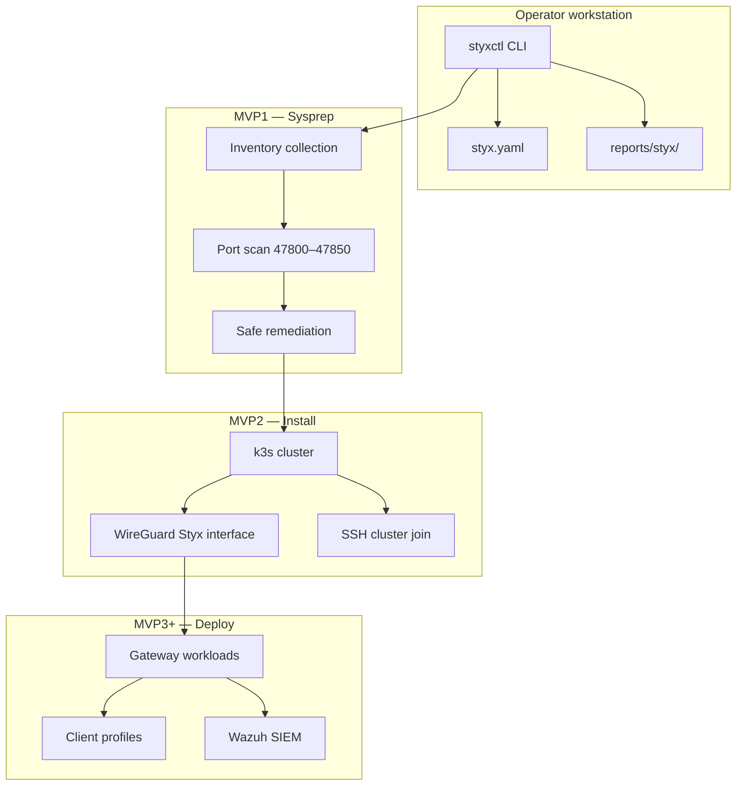

# styxctl

**The control CLI for [Styx](https://github.com/BradyWill42/styx)** — a k3s-native, dual-stack WireGuard mesh and access gateway platform.

`styxctl` prepares Linux gateway nodes, installs the k3s foundation, and (in future milestones) deploys the full Styx mesh. The CLI is **command-discovery-first**: composable subcommands, no workflow flags, and shell tab completion.

| | |
|---|---|
| **Version** | `0.3.0` |
| **Python** | 3.10+ |
| **License** | MIT |
| **Status** | MVP1 + MVP2 shipped on `main` |

---

## Table of contents

- [What is Styx?](#what-is-styx)
- [Architecture](#architecture)
- [Quick start](#quick-start)
- [Milestone roadmap](#milestone-roadmap)
- [MVP1: Assess and remediate](#mvp1-assess-and-remediate)
- [MVP2: Install prerequisites](#mvp2-install-prerequisites)
- [Configuration (`styx.yaml`)](#configuration-styxyaml)
- [Reserved port plan](#reserved-port-plan)
- [Safety doctrine](#safety-doctrine)
- [Command reference](#command-reference)
- [Reports and artifacts](#reports-and-artifacts)
- [Troubleshooting](#troubleshooting)
- [Development](#development)
- [Continuous integration](#continuous-integration)
- [License](#license)

---

## What is Styx?

Styx is a homelab and small-site platform that combines:

- **k3s** for lightweight Kubernetes orchestration across gateway nodes
- **Dual-stack WireGuard** (`Styx` interface on UDP `47800`) for mesh connectivity — separate from any existing `wg0` tunnel you already run
- **Reserved service ports** (`47800–47850`) for gateway APIs, agents, diagnostics, and metrics
- **Declarative cluster config** in `styx.yaml` — nodes, CIDRs, DNS endpoints, and future SIEM integration

`styxctl` is the operator-facing tool that drives each phase. It collects inventory, remediates only what is provably safe, installs k3s with your network plan, and writes human-readable plus machine-readable reports at every step.

---

## Architecture



**Node roles** (defined in `styx.yaml`):

| Role | Purpose |
|------|---------|
| `init-server` | Bootstraps the k3s cluster with `--cluster-init` and dual-stack CIDRs |
| `server` | Additional k3s control-plane / server node |
| `agent` | k3s worker node |

Each node uses `public_ipv4` (router WAN IP with port forwards) for bootstrap SSH and k3s joins when it is the site's entrypoint or a remote node, `lan_ip` for co-located LAN routing, `hostname` (DuckDNS) for stable naming after the cluster is connected, and mesh `ipv4` / `ipv6` for k3s `--node-ip`. **SSH runs on port 22 (admin/runner) and on `gateway.ssh_port` (47810, Styx cluster)** — both listen together after `install apply local`. Install and cluster join use gateway ports `47810` (SSH) and `47811` (k3s API); co-located nodes without their own port-forward join over the LAN or outbound NAT. DuckDNS is published only after networking, LAN leader election, and node joins succeed.

---

## Repository

All development happens on [`main`](https://github.com/BradyWill42/styx/tree/main). It contains the full MVP1 (sysprep) and MVP2 (install) platform, including `public_ipv4` bootstrap, DuckDNS post-cluster publish, gateway ports, and LAN leader election.

- Bootstrap connectivity uses each node's `public_ipv4` and router 1:1 port forwards (`47810` SSH, `47811` k3s API).
- DuckDNS (`hostname`) is published only after local networking, LAN leader election, and cluster join succeed.
- `cluster.leader: lan-elected` elects the strongest configured peer on the local LAN (UDP `47802`), ignoring peers not listed in `styx.yaml`. Co-located nodes may share one `public_ipv4` when election is enabled; the elected leader becomes that site's entrypoint for port-forwards and ProxyJump routing.

---

## Quick start

### 1. Install `styxctl`

```bash
git clone https://github.com/BradyWill42/styx.git
cd styx

python3 -m venv .venv
source .venv/bin/activate
python -m pip install --upgrade pip
python -m pip install -e .
```

Verify:

```bash
styxctl version
styxctl --help
```

### 2. Prepare a gateway node (MVP1)

```bash
styxctl sysprep check local
styxctl sysprep safe plan local      # preview only
styxctl sysprep safe apply local     # apply without prompt
styxctl sysprep check local          # re-check until READY
```

### 3. Install the foundation (MVP2)

**Minimal bootstrap** (only SSH keys between nodes; DuckDNS comes after the cluster is up):

```bash
cp styx.yaml.runners styx.yaml   # or styx.yaml.example for full explicit config
styxctl config validate          # auto-detects public_ipv4/public_ipv6 (curl -4/-6) + lan_ip

styxctl install plan local
styxctl install apply local      # adds gateway SSH on 47810 alongside port 22

styxctl install plan cluster
styxctl install apply cluster    # cluster SSH on gateway.ssh_port (47810)
```

**Full config** (explicit IPs + DuckDNS hostnames):

```bash
cp styx.yaml.example styx.yaml
# Set each node's public_ipv4 (router WAN), DuckDNS hostname, and lan_ip when co-located
export DUCKDNS_TOKEN=your-token
styxctl config validate
```

### Requirements

| Requirement | MVP1 | MVP2 |
|-------------|------|------|
| Linux gateway host | Yes | Yes |
| Python 3.10+ (for CLI) | Yes | Yes |
| `sudo` (non-interactive for mutating commands) | Recommended | Required |
| `ss` / `iproute2` | Recommended | Installed by MVP2 |
| Passwordless SSH to configured nodes | No | Required for `install cluster` |
| `styx.yaml` | Optional | Required |

---

## Milestone roadmap

| Milestone | Status | Scope |
|-----------|--------|-------|
| **MVP1** | Shipped | Read-only inventory, port scan, safe remediation |
| **MVP2** | Shipped | k3s install, `Styx` WireGuard interface, multi-node cluster join |
| **MVP3** | Planned | `sysprep reset` / `nuke`, `deploy`, `gateway`, `status`, `doctor` |
| **MVP4** | Planned | Remote sysprep (`check all` / `check node`), `client`, `siem` |

Placeholder commands exist today and print a clear "not implemented" message — they never mutate the host.

---

## MVP1: Assess and remediate

MVP1 answers one question: **is this node safe to install Styx on?**

### Typical workflow

```bash
styxctl sysprep check local
styxctl sysprep safe plan local
styxctl sysprep safe apply local
styxctl sysprep check local
```

1. **Check** — read-only inventory and port scan
2. **Plan** — preview safe cleanup actions (no changes)
3. **Apply** — execute safe cleanup (or use `sysprep safe local` for interactive confirm)
4. **Re-check** — repeat until `READY` or `READY_WITH_WARNINGS`

### What `sysprep check local` collects

- Host identity, OS, kernel, architecture, boot time
- Network interfaces, default route, DNS resolvers, LAN IPs
- WireGuard interfaces (including `wg0` preservation status)
- Processes and systemd units listening on ports `47800–47850`
- k3s / flannel / CNI artifacts and leftover services
- Sudo availability, time sync, disk and memory snapshot
- Detected binaries (`k3s`, `kubectl`, `wg`, `ss`, etc.)

### Readiness status

| Status | Meaning | Exit code |
|--------|---------|-----------|
| `READY` | Clear to proceed to MVP2 | `0` |
| `READY_WITH_WARNINGS` | Usable; review warnings first | `0` |
| `BLOCKED` | Critical ports `47800–47808` occupied | `1` |

When blocked, try `styxctl sysprep safe plan local` to preview cleanup, or `styxctl ports check local` to inspect conflicts.

### Safe remediation scope

**Will act on** (only when marked `safe_to_stop`):

- Styx / k3s / flannel / CNI processes in the reserved port range
- Known leftover services: `k3s.service`, `k3s-agent.service`
- Temporary Styx files under `/tmp/styx*` and `/var/tmp/styx*`

**Will never touch**:

- `wg0` or its configuration
- LAN networking, SSH, BIND, Caddy, MooseFS, home directories
- Unsafe port conflicts (non-Styx/k3s processes)
- k3s data directories (reserved for MVP3 `reset` / `nuke`)

### Port commands

```bash
styxctl ports check local          # conflicts in 47800–47850
styxctl ports list local           # full port plan
styxctl ports clear plan local     # preview safe port cleanup
styxctl ports clear apply local    # apply safe port cleanup
styxctl ports clear local          # interactive confirm
```

---

## MVP2: Install prerequisites

After MVP1 reports `READY` or `READY_WITH_WARNINGS`, MVP2 installs the local foundation on each node and optionally joins a multi-node k3s cluster.

### Typical workflow

```bash
cp styx.yaml.example styx.yaml
# Set each node's public_ipv4 (router WAN), DuckDNS hostname, and lan_ip when co-located
# Export DUCKDNS_TOKEN for post-cluster DNS publish
export DUCKDNS_TOKEN=your-token
styxctl config validate

# Per-node local install (run on every gateway)
styxctl install plan local
styxctl install apply local

# Cluster join over each node's public_ipv4 (router port forwards to 47810/47811)
styxctl install plan cluster
styxctl install apply cluster

# Verify
styxctl install status local
styxctl install status cluster
styxctl install doctor local
styxctl install doctor cluster
```

Each node uses:

- `public_ipv4` — router WAN IP with 1:1 port forwards to this Pi (`47810` SSH, `47811` k3s API) for bootstrap connectivity when this node is the site entrypoint or a remote node
- `lan_ip` — optional LAN address for co-located nodes sharing one `public_ipv4`; used for ProxyJump SSH and same-site k3s joins
- `site_entrypoint` — optional override marking the single host per shared-WAN site that owns port-forwards (election sets this automatically)
- `hostname` — DuckDNS name published **after** the cluster is connected
- `ipv4` / `ipv6` — mesh addresses passed to k3s as `--node-ip` (internal overlay, not your LAN or public IP)

Bootstrap order: local networking install -> LAN leader election (if enabled) -> cluster join over `public_ipv4` -> DuckDNS publish -> steady-state checks over DuckDNS hostnames.

### LAN leader election

When multiple Styx gateways share a LAN, enable automatic leader election in `styx.yaml`:

```yaml
cluster:
  leader: lan-elected
  lan_election:
    port: 47802
    collect_sec: 3
```

Before `install plan local`, `install apply local`, and `install apply cluster`, styxctl:

1. Broadcasts on the local subnet (UDP port `47802`, Styx director API)
2. Collects peer announcements from other Styx nodes on the same LAN
3. Keeps only peers listed in `styx.yaml` `nodes`
4. Scores each remaining peer by RAM, CPU cores, architecture, disk, and existing k3s
5. Elects the strongest configured peer on this LAN as leader

If the configured `init-server` is on the same LAN and two or more peers are present, the elected leader is promoted to `init-server` and the previous init-server is demoted to `server`. The elected leader is also marked as that site's **entrypoint** (the single host that owns router port-forwards). If the init-server lives on a different site, election still picks a LAN leader for visibility but k3s roles stay unchanged.

### Co-located nodes behind one WAN IP

Homelab setups often have two or more gateway Pis on the same LAN behind one router. They share a single `public_ipv4` because the router can only forward each external port (`47810` SSH, `47811` k3s API) to one host. Enable `cluster.leader: lan-elected` and set each Pi's `lan_ip`:

```yaml
cluster:
  leader: lan-elected

nodes:
  - name: pegasus
    public_ipv4: 71.104.114.70
    lan_ip: 192.168.1.10
    role: init-server
    # ...
  - name: atlas
    public_ipv4: 71.104.114.70   # same WAN IP — allowed with lan-elected
    lan_ip: 192.168.1.11
    role: server
```

Election picks the site **entrypoint** (strongest peer on that LAN). Only the entrypoint needs inbound port-forwards; co-located peers join k3s outbound through NAT and are reached over the LAN:

| From | To | Mechanism |
|------|-----|-----------|
| operator | site entrypoint | SSH to `public_ipv4:47810` |
| operator on that LAN | LAN-internal node | SSH direct to `lan_ip:47810` |
| operator elsewhere | LAN-internal node | SSH `ProxyJump` through the entrypoint, then `lan_ip` |
| node, same site | init-server | k3s join `https://<init lan_ip>:47811` |
| node, different site | init-server | k3s join `https://<init public_ipv4>:47811` |

When `styxctl install apply cluster` runs on the shared LAN, election auto-fills missing `lan_ip` values from peer discovery. If you orchestrate from a different site, set `lan_ip` explicitly for every co-located node.

Set `site_entrypoint: true` on exactly one node per shared-WAN site when using `cluster.leader: static` instead of election.

Cluster health checks use the same site-aware routing. `styxctl install status cluster` and `styxctl install doctor cluster` resolve co-located peers through the elected entrypoint, fall back to the site's `init-server` when election data is unavailable, and report node validation warnings without blocking otherwise healthy plans.

Preview or inspect election without installing:

```bash
styxctl install plan lan
styxctl install status lan
```

### Port forwards (router)

Forward the Styx reserved range on each gateway node's router to that node:

| External (WAN) | Forward to node | Service |
|---|---|---|
| `47800/udp` | `47800/udp` | Styx WireGuard |
| `47810/tcp` | `47810/tcp` | SSH (sshd listens on Pi) |
| `47811/tcp` | `47811/tcp` | k3s API (k3s listens on Pi) |

`install apply local` adds a drop-in so sshd also listens on `gateway.ssh_port` and `gateway.k3s_api_port` — **port 22 stays up** for admin and GitHub runner access. Router forwards are 1:1 — same port outside and inside. styxctl connects to `public_ipv4:47810` for cluster SSH and `https://public_ipv4:47811` for k3s join.

### What MVP2 installs

| Component | Detail |
|-----------|--------|
| **Packages** | `iproute2`, WireGuard tools, `curl`, `ca-certificates` via supported `apt`, `dnf`, or `yum` hosts |
| **k3s** | Server or agent role per `styx.yaml`; dual-stack pod/service CIDRs |
| **WireGuard** | `Styx` interface on UDP `47800` (never `wg0`) |
| **Firewall** | Minimal allowance for Styx WireGuard UDP when `ufw`, `firewalld`, or `nftables` is detected |
| **Preservation** | `wg0` config hash/mtime snapshotted before and verified after |

### Install gates

Install is **blocked** when:

- `styx.yaml` is missing or `INVALID`
- Sysprep status is `BLOCKED` on ports `47800–47808`
- Non-interactive `sudo` is unavailable for mutating install steps
- Cluster join cannot reach remote nodes over SSH

Always run `install plan` before `install apply`. Interactive commands (`install local`, `install cluster`) ask for confirmation; `install apply` variants skip the prompt.

### Cluster install order

1. `init-server` node — `curl -sfL https://get.k3s.io` with `--cluster-init` and network CIDRs
2. `server` nodes — join with token from init-server
3. `agent` nodes — join as k3s agents

Remote steps use each node's `ssh_user` when set, otherwise `cluster.ssh_user` (default in example: `ubuntu`). styxctl connects to each node's `public_ipv4` on `gateway.ssh_port` (`47810` by default) and joins k3s at `https://<public_ipv4>:47811`. Ensure key-based SSH works from the machine running `styxctl` to every configured `public_ipv4`. After the cluster is healthy, DuckDNS hostnames are published. You can also set `cluster.join_token` when a non-init node must join without fetching the token from the init-server over SSH.

### Health checks

`install doctor local` exits `0` when healthy enough for MVP3 deploy work. It verifies:

- k3s installed and active
- `kubectl` available
- `Styx` WireGuard interface up
- UDP `47800` listening
- `wg0` preserved unchanged
- Critical ports clear

`install doctor cluster` checks reachability and k3s status for every configured node.

---

## Configuration (`styx.yaml`)

### Minimal out-of-the-box (`styx.yaml.runners`)

For a three-node lab (pegasus, atlas, thor) you only need:

1. **Hostnames** match node names (`pegasus`, `atlas`, `thor`)
2. **Passwordless SSH** between nodes on port **22**

```bash
cp styx.yaml.runners styx.yaml
styxctl config validate
```

`styxctl` auto-detects each node's `public_ipv4` and `public_ipv6` (`curl -4` / `curl -6` locally; same over SSH to peers) and `lan_ip` for co-located nodes. Mesh overlay IPs are assigned from node order. No DuckDNS block, no `/etc/styx` setup, no manual WAN/LAN fields.

```yaml
cluster:
  name: styx
  leader: lan-elected
  ssh_user: ubuntu
  bootstrap: true

nodes:
  - name: pegasus
    role: init-server
  - name: atlas
    role: agent
  - name: thor
    role: server
```

Add `dns:` and `hostname` per node **after** the cluster joins; `install apply cluster` publishes DuckDNS then.

### Full explicit config

Copy the example and edit for your lab:

```bash
cp styx.yaml.example styx.yaml
styxctl config show
styxctl config validate
```

Styx ships with a fixed backbone IP plan (mesh, pod, service, and infra CIDRs). You do not configure those in `styx.yaml` — `styxctl` applies them automatically. Per-node mesh addresses (`10.0.0.1`, `10.0.0.2`, … and matching IPv6) are assigned from node list order.

### What you configure

```yaml
cluster:
  name: styx
  ssh_user: ubuntu          # default SSH user for cluster join
  # mode: dual-stack        # optional: dual-stack | ipv4-only | ipv6-only
  # leader: lan-elected     # optional: static | lan-elected (default)

nodes:
  - name: node-init
    hostname: styx-lab-init.duckdns.org   # DuckDNS subdomain (published after cluster join)
    public_ipv4: 203.0.113.10           # router WAN IP with 1:1 port forwards
    lan_ip: 192.168.1.10                # required when co-located behind one WAN IP
    role: init-server
  - name: node-server
    hostname: styx-lab-server.duckdns.org
    public_ipv4: 203.0.113.11
    role: server
  - name: node-agent
    hostname: styx-lab-agent.duckdns.org
    public_ipv4: 203.0.113.12
    role: agent

dns:
  token_env: DUCKDNS_TOKEN
```

**Important:** `public_ipv4` is each node's router WAN address with port forwards to `47810` (SSH) and `47811` (k3s API) — used for bootstrap SSH and k3s joins. `hostname` is published to DuckDNS **after** the cluster is connected. Mesh overlay IPs are assigned automatically; you only need `lan_ip` when multiple nodes share one `public_ipv4`.

Built-in defaults (no YAML required):

| Setting | Default |
|---------|---------|
| Cluster mode | `dual-stack` |
| LAN leader election | `lan-elected` on UDP `47802` |
| WireGuard interface / port | `Styx` / `47800` |
| Gateway SSH / k3s API ports | `47810` / `47811` |
| Pod CIDR (v4 / v6) | `10.2.0.0/16` / `fd00:cafe:2::/56` |
| Service CIDR (v4 / v6) | `10.3.0.0/16` / `fd00:cafe:3::/112` |
| Mesh CIDR (v4 / v6) | `10.0.0.0/16` / `fd00:cafe:0::/48` |

Config validation status:

| Status | Meaning |
|--------|---------|
| `VALID` | Ready for MVP2 |
| `VALID_WITH_WARNINGS` | Usable; e.g. no nodes defined yet |
| `INVALID` | Blocking errors; fix before install |

---

## Reserved port plan

Only ports `47800–47850` are managed by `styxctl`. Critical production ports `47800–47808` block MVP2 install when occupied.

| Port | Protocol | Purpose |
|------|----------|---------|
| 47800 | UDP | Styx production WireGuard gateway |
| 47801 | TCP | Styx gateway health API |
| 47802 | UDP | Styx director API / configured-node LAN leader election |
| 47803 | TCP | Styx status dashboard/API |
| 47804 | TCP | Styx node agent API |
| 47805 | TCP | Styx Ansible controller API |
| 47806 | TCP | Styx watchdog agent API |
| 47807 | TCP | Styx local diagnostics API |
| 47808 | TCP | Styx metrics exporter |
| 47809 | any | Reserved |
| 47810 | TCP | SSH gateway listen |
| 47811 | TCP | k3s API gateway listen |
| 47812–47819 | any | Site/gateway spare |
| 47820–47829 | any | Client/profile testing |
| 47830–47839 | any | Development/debug |
| 47840–47850 | any | Reserved future |

Planned WireGuard endpoint for production clients:

```ini
Endpoint = styx-lab-init.duckdns.org:47800
```

---

## Safety doctrine

Styx is designed for gateway nodes that may already run critical services. `styxctl` enforces strict boundaries:

| Command class | Mutates host? | Scope |
|---------------|---------------|-------|
| `sysprep check`, `ports check`, `ports list`, `config show`, `install plan`, `install status`, `install doctor`, `uninstall plan`, `report`, `version`, `completion` | No | Read-only host inspection |
| `sysprep safe`, `ports clear`, `install apply`, `uninstall apply` | Yes | Only pre-identified safe targets |
| `sysprep reset`, `sysprep nuke`, `deploy` | MVP3 | Not implemented yet |

**`wg0` is sacred.** It is inventoried, reported, and hash-verified — never removed or modified by MVP1 or MVP2.

Read-only planning and reporting commands may write local artifacts under `reports/styx/`; they do not mutate gateway services or networking.

Every mutating command follows **plan → confirm → apply**:

```bash
styxctl sysprep safe plan local     # dry-run
styxctl sysprep safe local          # preview + confirm
styxctl sysprep safe apply local    # apply without confirm
```

---

## Command reference

Discover commands with tab completion:

```bash
styxctl <TAB>
styxctl sysprep <TAB>
styxctl install <TAB>
```

### Sysprep

| Command | Description |
|---------|-------------|
| `sysprep check local` | Read-only MVP1 assessment |
| `sysprep check all` | MVP4 placeholder |
| `sysprep check node` | MVP4 placeholder |
| `sysprep safe plan local` | Preview safe cleanup |
| `sysprep safe apply local` | Apply safe cleanup (no prompt) |
| `sysprep safe local` | Preview + interactive confirm |
| `sysprep reset local` | MVP3 placeholder |
| `sysprep nuke local` | MVP3 placeholder |

### Ports

| Command | Description |
|---------|-------------|
| `ports check local` | Show conflicts in reserved range |
| `ports list local` | Show full port plan |
| `ports clear plan local` | Preview safe port cleanup |
| `ports clear apply local` | Apply safe port cleanup |
| `ports clear local` | Interactive port cleanup |

### Install

| Command | Description |
|---------|-------------|
| `install plan local` | Preview local install steps |
| `install plan cluster` | Preview cluster join steps |
| `install plan lan` | Preview LAN leader election |
| `install local` | Local install with confirm |
| `install apply local` | Local install without confirm |
| `install cluster` | Cluster install with confirm |
| `install apply cluster` | Cluster install without confirm |
| `install status local` | k3s + WireGuard status table |
| `install status cluster` | Site-aware all-node reachability table |
| `install status lan` | Show LAN peers and elected leader |
| `install doctor local` | Actionable local health diagnosis |
| `install doctor cluster` | Site-aware cluster-wide health diagnosis |

### Uninstall

Removes only what Styx installed: k3s, the `Styx` WireGuard interface (including `wg-quick@Styx.service` if enabled), gateway SSH drop-in, and Styx firewall allowances. **Does not** remove persistent runner configs, `wg0`, other WireGuard tunnels, GitHub Actions runner registration, or OS packages.

| Command | Description |
|---------|-------------|
| `uninstall plan local` | Preview local removal steps and preserved configs |
| `uninstall plan cluster` | Preview cluster-wide removal (per-node pending steps) |
| `uninstall local` | Local uninstall with confirm |
| `uninstall apply local` | Local uninstall without confirm |
| `uninstall cluster` | Cluster uninstall with confirm |
| `uninstall apply cluster` | Cluster uninstall without confirm |

On self-hosted runners, `/etc/styx/styx.yaml` is preserved so the next workflow run can reuse site-specific settings. **Uninstall removes only Styx artifacts in the reserved port range (47800–47850)** — including the `styx-gateway.conf` sshd drop-in — and leaves **port 22** listening for admin and GitHub runner access. Always run `uninstall plan` first to review **Will remove** vs **Will preserve** sections.

```bash
styxctl uninstall plan local      # dry-run: shows preserved /etc/styx/styx.yaml, wg0, runner
styxctl uninstall apply local     # apply without prompt
styxctl uninstall plan cluster    # preview all nodes before CI teardown
styxctl uninstall apply cluster   # used by Styx cluster E2E workflow
```

### DNS

| Command | Description |
|---------|-------------|
| `dns refresh local` | Publish this node's current public IPv4 to its DuckDNS hostname |
| `dns refresh cluster` | Refresh DuckDNS for every configured node using SSH-detected public IPv4s |

### Config, sysprep reports, and shell

| Command | Description |
|---------|-------------|
| `config show` | Summarize active `styx.yaml` |
| `config validate` | Validate config; exit `1` if invalid |
| `report show [hostname]` | Display latest sysprep report |
| `report json [hostname]` | Print sysprep report as JSON |
| `version` | Print `styxctl` version |
| `completion bash\|zsh\|fish` | Print shell completion script |
| `--install-completion` | Install completion for active shell |

### Future (placeholders)

```bash
styxctl deploy soon      # MVP3
styxctl gateway soon     # MVP3
styxctl status soon      # MVP3
styxctl doctor soon      # MVP3
styxctl client soon      # MVP4
styxctl siem soon        # MVP4
```

---

## Reports and artifacts

### Sysprep reports (MVP1)

```text
./reports/styx/<hostname>/sysprep-report.json
./reports/styx/<hostname>/sysprep-report.txt
```

### Install reports (MVP2)

```text
./reports/styx/<hostname>/install-report.json
./reports/styx/<hostname>/install-report.txt
```

Inspect saved sysprep reports:

```bash
styxctl report show
styxctl report json
```

Sysprep reports include timestamps, readiness status, warnings, blocking reasons, inventory snapshots, and planned/applied action outcomes. Install plan/apply commands also save `install-report.*` artifacts in the same host report directory; the `report` subcommands currently read the sysprep report bundle.

---

## Troubleshooting

### `BLOCKED` after sysprep check

```bash
styxctl ports check local
styxctl sysprep safe plan local
styxctl sysprep safe apply local
styxctl sysprep check local
```

If a non-Styx process holds a critical port, stop it manually — MVP1 will not kill unsafe processes.

### Install blocked: invalid config

```bash
styxctl config validate
```

Common fixes: set node `hostname` to the correct DuckDNS name, mesh IPs for k3s `--node-ip`, ensure exactly one `init-server`, port-forward `47810`/`47811`, and keep `wireguard.interface` as `Styx` (not `wg0`).

### Install blocked: sudo unavailable

Ensure passwordless sudo for the installing user, or run from an account that has it:

```bash
sudo -n true && echo "sudo ok" || echo "sudo required"
```

### k3s not active after install

```bash
sudo systemctl status k3s
styxctl install doctor local
styxctl install apply local
```

### Cluster join failures

```bash
# From init-server, verify SSH to each node hostname on gateway port 47810
ssh -p 47810 ubuntu@<node-hostname> true

styxctl install status cluster
styxctl install doctor cluster
```

Ensure every node has completed `install apply local` before `install apply cluster`.

### `wg0` preservation warning

Investigate any changes to `/etc/wireguard/wg0.conf` before retrying. MVP2 snapshots `wg0` before install and compares afterward.

---

## Development

### Setup

```bash
python -m pip install -e ".[dev]"
```

### Run tests

```bash
python -m pytest -v
```

### Manual smoke checks

```bash
styxctl sysprep check local
styxctl sysprep safe plan local
styxctl config validate
styxctl install plan local
styxctl report show
```

### Project layout

```text
src/styxctl/
  cli.py              # Typer entry point and command tree
  inventory.py        # Read-only host inventory (MVP1)
  ports.py            # Reserved port scan and plan
  remediation.py      # Safe cleanup actions (MVP1)
  reports.py          # Sysprep report generation
  config.py           # styx.yaml load and validate
  nodes.py            # Cluster node parsing
  install.py          # Local + cluster install (MVP2)
  k3s_cluster.py      # k3s cluster planning and SSH orchestration
  install_report.py   # Install report generation
tests/                # pytest suite
styx.yaml.example     # Reference cluster configuration
```

---

## Continuous integration

Every pull request and push to `main` runs two layers:

1. **CI** (GitHub-hosted) — unit tests for dev feedback; **not** the homelab gate
2. **Styx runner integration** (self-hosted) — **primary gate** on live pegasus, atlas, and thor

### Styx runner integration (primary)

Two stages on every **online** self-hosted runner:

| Stage | What it checks |
|-------|----------------|
| **1 — prerequisites** | Runner identity, sudo, tools, `sysprep check local` (ports), `config validate` |
| **2 — connectivity** | Real SSH to every other runner on **gateway port 47810** |

Uses `styx.yaml.runners` copied to `styx.yaml` on each runner.

```bash
python3 .github/scripts/stage1-prerequisites.py   # on any runner
python3 .github/scripts/stage2-connectivity.py
```

### CI (secondary)

Python 3.12 on `ubuntu-latest`: `pytest` + wheel build. Can pass while hardware is broken.

### Self-hosted runners

| Runner | Role |
|--------|------|
| `pegasus` | Hub site (co-located with atlas) |
| `atlas` | Hub site (co-located with pegasus) |
| `thor` | Remote site |

| Workflow | Trigger | Purpose |
|----------|---------|---------|
| **Styx runner integration** | Push / PR | **Primary gate** — live checks on all online runners |
| **Runner smoke** | Manual | Quick online-runner ping |
| **Styx cluster E2E** | Manual | Destructive install → join → uninstall |

The `tests/` unit suite is for local development. Runner stages above are the homelab gate (pre-MVP3).

View results in **Actions**. Artifacts: `styx-runner-integration-<runner>`.

---

## License

MIT — see [LICENSE](LICENSE).

Copyright (c) 2026 Brady Williams
