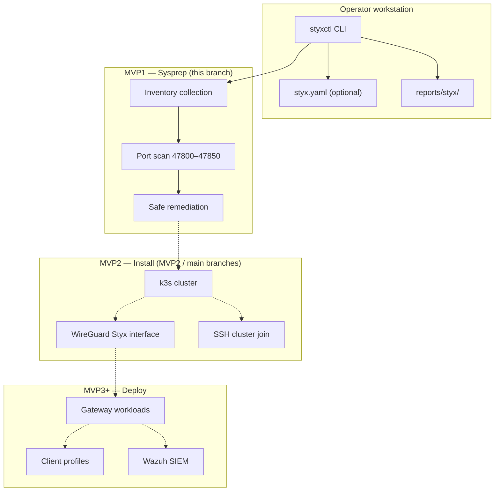

# styxctl

**The control CLI for [Styx](https://github.com/BradyWill42/styx)** — a k3s-native, dual-stack WireGuard mesh and access gateway platform.

`styxctl` prepares Linux gateway nodes for Styx installation. On this branch, **MVP1** is fully implemented: read-only assessment, reserved-port scanning, and bounded safe remediation. Install and cluster commands live on the [`MVP2`](https://github.com/BradyWill42/styx/tree/MVP2) and [`main`](https://github.com/BradyWill42/styx/tree/main) branches.

Every command is **command-discovery-first**: no flags, just composable subcommands with shell tab completion.

| | |
|---|---|
| **Version** | `0.2.0` (MVP1 branch) |
| **Python** | 3.10+ |
| **License** | MIT |
| **Status** | MVP1 shipped on this branch |

---

## Table of contents

- [What is Styx?](#what-is-styx)
- [Architecture](#architecture)
- [Repository branches](#repository-branches)
- [Quick start](#quick-start)
- [Milestone roadmap](#milestone-roadmap)
- [MVP1: Assess and remediate](#mvp1-assess-and-remediate)
- [MVP2 and beyond](#mvp2-and-beyond)
- [Configuration (`styx.yaml`)](#configuration-styxyaml)
- [Reserved port plan](#reserved-port-plan)
- [Safety doctrine](#safety-doctrine)
- [Command reference](#command-reference)
- [Reports and artifacts](#reports-and-artifacts)
- [Troubleshooting](#troubleshooting)
- [Development](#development)
- [Continuous integration](#continuous-integration)
- [License](#license)

---

## What is Styx?

Styx is a homelab and small-site platform that combines:

- **k3s** for lightweight Kubernetes orchestration across gateway nodes
- **Dual-stack WireGuard** (`Styx` interface on UDP `47800`) for mesh connectivity — separate from any existing `wg0` tunnel you already run
- **Reserved service ports** (`47800–47850`) for gateway APIs, agents, diagnostics, and metrics
- **Declarative cluster config** in `styx.yaml` — nodes, CIDRs, DNS endpoints, and future SIEM integration

`styxctl` is the operator-facing tool that drives each phase. On **MVP1**, it collects inventory, scans ports, remediates only what is provably safe, and writes human-readable plus machine-readable reports.

---

## Architecture



Dashed lines indicate milestones not yet available on this branch.

---

## Repository branches

| Branch | Contents | Use when |
|--------|----------|----------|
| **`MVP1` (you are here)** | Assessment and safe remediation | Preparing a single gateway node |
| [`MVP2`](https://github.com/BradyWill42/styx/tree/MVP2) | MVP1 + k3s / WireGuard install, including configured-node LAN leader election on the latest branch | Installing the k3s foundation |
| [`main`](https://github.com/BradyWill42/styx/tree/main) | MVP1 + MVP2 integrated release | Default — full platform prep and install |

All branches share the same CLI design and safety rules. Feature work lands on `MVP1` or `MVP2` first, then merges into `main`.

Current branch notes:

- Documentation audit `2026-06-17 02:47 UTC`: fetched all remote branches (`main`, `MVP1`, and `MVP2`) before README propagation; since the 02:00 README audit after its push (`main` at `335d223`, `MVP1` at `b55002b`, `MVP2` at `75ab2c6`), only `MVP2` had new functional changes, advancing to `aa13882` with LAN leader election restricted to peers declared in `styx.yaml`.
- `MVP1` remains the assessment and safe-remediation snapshot; no MVP1 branch code changed since the last README audit.

---

## Quick start

### Install `styxctl`

```bash
git clone https://github.com/BradyWill42/styx.git
cd styxctl
git checkout MVP1

python3 -m venv .venv
source .venv/bin/activate
python -m pip install --upgrade pip
python -m pip install -e .
```

Verify:

```bash
styxctl version
styxctl --help
```

### Prepare a gateway node

```bash
styxctl sysprep check local
styxctl sysprep safe plan local      # plan only
styxctl sysprep safe apply local     # apply without prompt
styxctl sysprep check local          # re-check until READY
```

### Requirements

| Requirement | Needed for MVP1 |
|-------------|-----------------|
| Linux gateway host | Yes |
| Python 3.10+ | Yes |
| `sudo` (non-interactive for mutating commands) | Recommended |
| `ss` / `iproute2` | Recommended for port scanning |
| `styx.yaml` | Optional (validation only) |

---

## Milestone roadmap

| Milestone | Status on `MVP1` | Scope |
|-----------|------------------|-------|
| **MVP1** | **Shipped** | Read-only inventory, port scan, safe remediation |
| **MVP2** | On `MVP2` / `main` | k3s install, `Styx` WireGuard interface, cluster join |
| **MVP3** | Planned | `sysprep reset` / `nuke`, `deploy`, `gateway`, `status`, `doctor` |
| **MVP4** | Planned | Remote sysprep, `client`, `siem` |

Placeholder commands (`sysprep reset`, `deploy soon`, etc.) exist and print a clear "not implemented" message — they never mutate the host.

---

## MVP1: Assess and remediate

MVP1 answers one question: **is this node safe to install Styx on?**

### Typical workflow

```bash
styxctl sysprep check local
styxctl sysprep safe plan local
styxctl sysprep safe apply local
styxctl sysprep check local
```

1. **Check** — read-only inventory and port scan
2. **Plan** — show safe cleanup actions (no changes)
3. **Apply** — execute safe cleanup (or use `sysprep safe local` for interactive confirm)
4. **Re-check** — repeat until `READY` or `READY_WITH_WARNINGS`

### What `sysprep check local` collects

- Host identity, OS, kernel, architecture, boot time
- Network interfaces, default route, DNS resolvers, LAN IPs
- WireGuard interfaces (including `wg0` preservation status)
- Processes and systemd units listening on ports `47800–47850`
- k3s / flannel / CNI artifacts and leftover services
- Sudo availability, time sync, disk and memory snapshot
- Detected binaries (`k3s`, `kubectl`, `wg`, etc.)

### Readiness status

| Status | Meaning | Exit code |
|--------|---------|-----------|
| `READY` | Clear to proceed to MVP2 | `0` |
| `READY_WITH_WARNINGS` | Usable; review warnings first | `0` |
| `BLOCKED` | Critical ports `47800–47808` occupied | `1` |

When blocked, try `styxctl sysprep safe plan local` first, or `styxctl ports check local` to inspect conflicts.

### Safe remediation scope

**Will act on** (only when marked `safe_to_stop`):

- Styx / k3s / flannel / CNI processes in the reserved port range
- Known leftover services: `k3s.service`, `k3s-agent.service`
- Temporary Styx files under `/tmp/styx*` and `/var/tmp/styx*`

**Will never touch**:

- `wg0` or its configuration
- LAN networking, SSH, BIND, Caddy, MooseFS, home directories
- Unsafe port conflicts (non-Styx/k3s processes)
- k3s data directories (reserved for MVP3 `reset` / `nuke`)

### Port commands

```bash
styxctl ports check local          # conflicts in 47800–47850
styxctl ports list local           # full port plan
styxctl ports clear plan local     # plan safe port cleanup
styxctl ports clear apply local    # apply safe port cleanup
styxctl ports clear local          # interactive confirm
```

---

## MVP2 and beyond

When sysprep reports `READY` or `READY_WITH_WARNINGS`, switch to the **`MVP2`** or **`main`** branch for k3s and WireGuard installation:

```bash
git checkout main   # or MVP2
python -m pip install -e .
```

MVP2 adds:

- Per-node k3s install with dual-stack CIDRs from `styx.yaml`
- `Styx` WireGuard interface on UDP `47800`
- Multi-node cluster join over SSH from the init-server
- `install plan`, `install apply`, `install status`, and `install doctor` commands

See the [README on `main`](https://github.com/BradyWill42/styx/blob/main/README.md) for the full MVP2 workflow.

---

## Configuration (`styx.yaml`)

MVP1 works without a config file. Copy the example when you want to validate cluster layout before switching to MVP2:

```bash
cp styx.yaml.example styx.yaml
styxctl config show
styxctl config validate
```

Key fields (validated on this branch; used by MVP2 install):

| Section | Purpose |
|---------|---------|
| `cluster` | Name, domain, `dual-stack` mode, SSH user |
| `network` | IPv4/IPv6 supernets, mesh/infra/pod/service CIDRs |
| `wireguard` | Interface name (`Styx`, never `wg0`), port `47800` |
| `nodes` | One `init-server`, optional `server` / `agent` nodes with IPs |
| `dns` | DuckDNS provider and endpoint mapping |
| `siem` | Future Wazuh integration (MVP4) |

Config validation status:

| Status | Meaning |
|--------|---------|
| `VALID` | Structure is sound |
| `VALID_WITH_WARNINGS` | Usable; e.g. no nodes defined |
| `INVALID` | Blocking errors |

---

## Reserved port plan

Only ports `47800–47850` are managed by `styxctl`. Critical production ports `47800–47808` block progression to MVP2 when occupied.

| Port | Protocol | Purpose |
|------|----------|---------|
| 47800 | UDP | Styx production WireGuard gateway |
| 47801 | TCP | Styx gateway health API |
| 47802 | TCP | Styx director API |
| 47803 | TCP | Styx status dashboard/API |
| 47804 | TCP | Styx node agent API |
| 47805 | TCP | Styx Ansible controller API |
| 47806 | TCP | Styx watchdog agent API |
| 47807 | TCP | Styx local diagnostics API |
| 47808 | TCP | Styx metrics exporter |
| 47809 | any | Reserved |
| 47810–47819 | any | Site/gateway testing |
| 47820–47829 | any | Client/profile testing |
| 47830–47839 | any | Development/debug |
| 47840–47850 | any | Reserved future |

Planned WireGuard endpoint for production clients:

```ini
Endpoint = pistyx.duckdns.org:47800
```

---

## Safety doctrine

Styx is designed for gateway nodes that may already run critical services. `styxctl` enforces strict boundaries:

| Command class | Mutates host? | Scope |
|---------------|---------------|-------|
| `sysprep check`, `ports check`, `ports list`, `config show`, `report` | No | Read-only |
| `sysprep safe`, `ports clear` | Yes | Only pre-identified safe targets |
| `sysprep reset`, `sysprep nuke`, `install`, `deploy` | Not on `MVP1` | Available on later branches / milestones |

**`wg0` is sacred.** It is inventoried and reported — never removed or modified by MVP1.

Every mutating command follows **plan → confirm → apply**:

```bash
styxctl sysprep safe plan local     # plan only (no changes)
styxctl sysprep safe local          # plan + confirm
styxctl sysprep safe apply local    # apply without confirm
```

---

## Command reference

Discover commands with tab completion:

```bash
styxctl <TAB>
styxctl sysprep <TAB>
styxctl ports <TAB>
```

### Sysprep

| Command | Description |
|---------|-------------|
| `sysprep check local` | Read-only MVP1 assessment |
| `sysprep check all` | MVP4 placeholder |
| `sysprep check node` | MVP4 placeholder |
| `sysprep safe plan local` | Plan safe cleanup (read-only) |
| `sysprep safe apply local` | Apply safe cleanup (no prompt) |
| `sysprep safe local` | Plan + interactive confirm |
| `sysprep reset local` | MVP3 placeholder |
| `sysprep nuke local` | MVP3 placeholder |

### Ports

| Command | Description |
|---------|-------------|
| `ports check local` | Show conflicts in reserved range |
| `ports list local` | Show full port plan |
| `ports clear plan local` | Plan safe port cleanup |
| `ports clear apply local` | Apply safe port cleanup |
| `ports clear local` | Interactive port cleanup |

### Config, reports, and shell

| Command | Description |
|---------|-------------|
| `config show` | Summarize active `styx.yaml` |
| `config validate` | Validate config; exit `1` if invalid |
| `report show [hostname]` | Display latest sysprep report |
| `report json [hostname]` | Print sysprep report as JSON |
| `version` | Print `styxctl` version |
| `completion bash\|zsh\|fish` | Print shell completion script |
| `--install-completion` | Install completion for active shell |

### Future (placeholders on this branch)

```bash
styxctl install plan local   # MVP2 placeholder
styxctl install apply local  # MVP2 placeholder
styxctl deploy soon          # MVP3
styxctl gateway soon         # MVP3
styxctl client soon          # MVP4
styxctl siem soon            # MVP4
```

Full install implementation is on the **`MVP2`** and **`main`** branches.

---

## Reports and artifacts

Sysprep reports are written after every `sysprep check local`:

```text
./reports/styx/<hostname>/sysprep-report.json
./reports/styx/<hostname>/sysprep-report.txt
```

Inspect saved reports:

```bash
styxctl report show
styxctl report json
```

Reports include timestamps, readiness status, warnings, blocking reasons, inventory snapshots, and remediation outcomes.

---

## Troubleshooting

### `BLOCKED` after sysprep check

```bash
styxctl ports check local
styxctl sysprep safe plan local
styxctl sysprep safe apply local
styxctl sysprep check local
```

If a non-Styx process holds a critical port, stop it manually — MVP1 will not kill unsafe processes.

### Warnings about k3s leftovers

Safe remediation can stop known k3s services and processes. Preview first:

```bash
styxctl sysprep safe plan local
```

Deeper k3s state cleanup requires MVP3 `sysprep reset` (not yet implemented).

### Config validation errors

```bash
styxctl config validate
```

Ensure `wireguard.interface` is `Styx` (not `wg0`) and node IPs are valid if defined.

### Sudo unavailable

Non-interactive sudo is recommended for `sysprep safe apply` and `ports clear apply`:

```bash
sudo -n true && echo "sudo ok" || echo "sudo required"
```

---

## Development

### Setup

```bash
python -m pip install -e ".[dev]"
```

### Run tests

```bash
python -m pytest -v
```

### Manual smoke checks

```bash
styxctl sysprep check local
styxctl sysprep safe plan local
styxctl config validate
styxctl report show
```

### Project layout (MVP1 branch)

```text
src/styxctl/
  cli.py              # Typer entry point and command tree
  inventory.py        # Read-only host inventory
  ports.py            # Reserved port scan and plan
  remediation.py      # Safe cleanup actions
  reports.py          # Sysprep report generation
  config.py           # styx.yaml load and validate
tests/                # pytest suite
styx.yaml.example     # Reference cluster configuration
```

---

## Continuous integration

Every push and pull request to `MVP1`, `MVP2`, or `main` runs:

1. **Test matrix** — Python 3.10, 3.11, 3.12: pytest, CLI smoke, wheel build
2. **Sysprep smoke** — read-only `sysprep check` on a GitHub-hosted Ubuntu runner; uploads report artifacts

View results in the repository **Actions** tab. Download the **sysprep-report-github-hosted** artifact to inspect JSON and text reports from CI.

CI validates the check and plan path on real Linux, but it is **not** a substitute for running MVP1 on your own gateway hardware.

---

## License

MIT — see [LICENSE](LICENSE).

Copyright (c) 2026 Brady Williams
